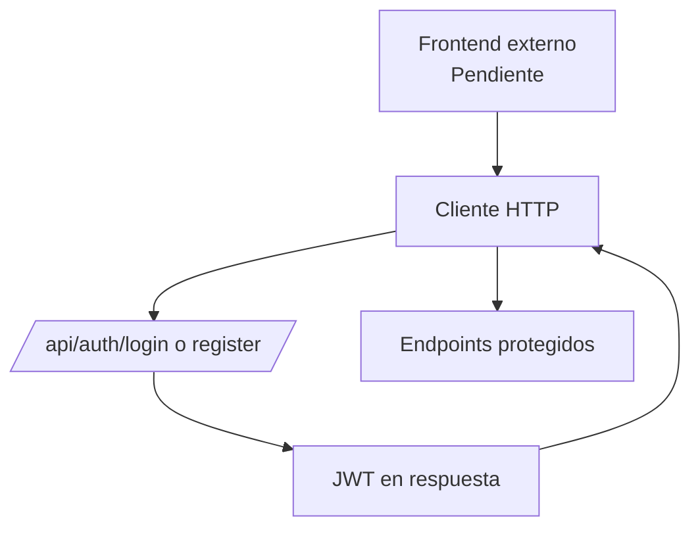
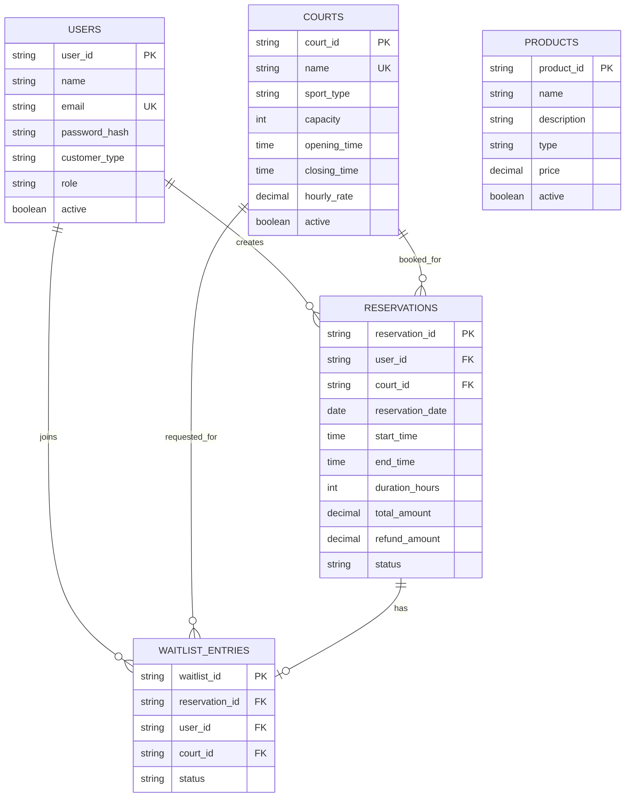
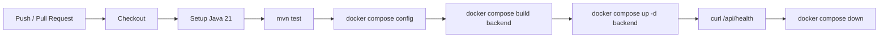
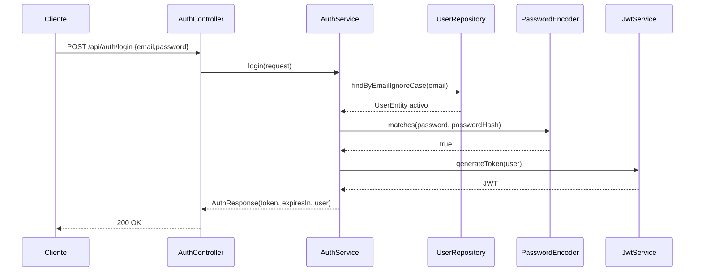
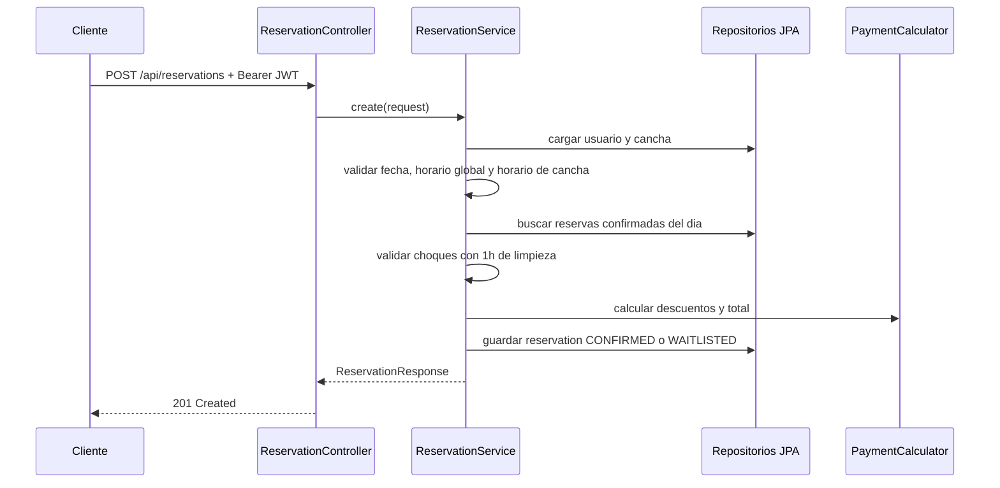

# Arquitectura Tecnica - prueba_ceiba_springboot

## 1. Vision General

`prueba_ceiba_springboot` es una API backend para Deportal, un sistema de reservas de canchas deportivas. Expone endpoints REST para autenticacion, gestion de canchas, reservas, cancelaciones, lista de espera, calculo de pagos y reportes de utilizacion e ingresos.

La aplicacion esta construida como monolito modular Spring Boot con capas de controlador, servicio, repositorio, entidades JPA y DTOs. Usa JWT stateless para proteger la API, H2 como base de datos local persistida en archivo y Swagger/OpenAPI para documentacion interactiva.

```mermaid
graph TB
    Client[Cliente / Navegador / App Frontend]
    LB[Balanceador de carga\n[Pendiente: definir en produccion]]
    App[Servidor de aplicacion\nSpring Boot 3.5.8 / Java 21]
    DB[(Base de datos H2\narchivo local)]
    Swagger[Swagger UI / OpenAPI]
    CI[GitHub Actions\nBackend CI]
    Docker[Docker Compose\nbackend]

    Client -->|HTTP REST / JSON| LB
    LB --> App
    Client -->|Bearer JWT| App
    App --> DB
    App --> Swagger
    CI -->|mvn test| App
    CI -->|docker compose build/up| Docker
    Docker --> App
```

> Nota: no hay evidencia en el repositorio de balanceadores, base de datos administrada, servicios cloud ni entorno productivo. Se documentan como pendientes.

## 2. Estructura del Proyecto

```text
.
├── .github/workflows/          # Pipeline CI de backend
├── data/                       # Datos locales H2 generados en runtime
├── docs/                       # Documentacion del proyecto
├── src/main/java/com/deportal/ # Codigo fuente principal
│   ├── auth/                   # Registro, login y usuario autenticado
│   ├── config/                 # OpenAPI, Clock y carga de datos semilla
│   ├── courts/                 # Gestion de canchas deportivas
│   ├── health/                 # Health check basico
│   ├── payments/               # Calculo de tarifas y descuentos
│   ├── products/               # Catalogo de productos semilla
│   ├── reports/                # Reportes de utilizacion e ingresos
│   ├── reservations/           # Reservas, cancelaciones y estados
│   ├── security/               # Spring Security, JWT y CORS
│   ├── shared/                 # Errores, excepciones y sanitizacion
│   └── waitlist/               # Lista de espera para reservas
├── src/main/resources/         # Configuracion application.yml
├── src/test/java/com/deportal/ # Pruebas unitarias y de contexto
├── Dockerfile                  # Imagen multi-stage Maven + Temurin JRE
├── docker-compose.yml          # Servicio backend local
├── pom.xml                     # Dependencias Maven
└── README.md                   # Documentacion base del repositorio
```

## 3. Stack Tecnologico Detallado

### 3.1 Backend

| Tecnologia | Version | Uso |
|---|---:|---|
| Java | 21 | Lenguaje principal |
| Spring Boot | 3.5.8 | Framework backend |
| Spring MVC | Incluido en starter web | API REST |
| Spring Security | Incluido en starter security | Autenticacion y autorizacion |
| Spring Data JPA | Incluido en starter data-jpa | Persistencia ORM |
| Hibernate | Gestionado por Spring Boot | Implementacion JPA |
| H2 Database | Gestionado por Spring Boot | Base de datos local en archivo |
| Maven | 3.9.11 en Dockerfile | Build y gestion de dependencias |
| Docker | [Pendiente: version minima] | Empaquetado y ejecucion local |

Dependencias backend principales:

| Nombre | Version | Uso |
|---|---:|---|
| `spring-boot-starter-web` | 3.5.8 | Controladores REST y JSON |
| `spring-boot-starter-validation` | 3.5.8 | Validaciones Jakarta Bean Validation |
| `spring-boot-starter-security` | 3.5.8 | Seguridad HTTP, filtros y password encoder |
| `spring-boot-starter-data-jpa` | 3.5.8 | Repositorios y entidades JPA |
| `h2` | Gestionada | Base de datos runtime |
| `springdoc-openapi-starter-webmvc-ui` | 2.8.14 | Swagger UI y OpenAPI |
| `jjwt-api` | 0.12.6 | Generacion y validacion JWT |
| `jjwt-impl` | 0.12.6 | Implementacion runtime JWT |
| `jjwt-jackson` | 0.12.6 | Serializacion JWT |
| `spring-boot-starter-test` | 3.5.8 | Pruebas automatizadas |

### 3.2 Frontend

No hay frontend versionado en este repositorio. La configuracion CORS permite por defecto `http://localhost:4200`, lo que sugiere un cliente local externo, probablemente Angular, pero no esta confirmado por el codigo.

| Aspecto | Estado |
|---|---|
| Framework JS | `[Pendiente: definir]` |
| Router | `[Pendiente: definir]` |
| Store | `[Pendiente: definir]` |
| Biblioteca UI | `[Pendiente: definir]` |
| Servicios HTTP | Consumir REST JSON con `Authorization: Bearer <token>` |



## 4. Modelo de Datos / Base de Datos

La base de datos es SQL, gestionada con JPA/Hibernate. En local se usa H2 en modo compatibilidad PostgreSQL con `ddl-auto: update`.



Estrategia multi-tenancy: no aplica actualmente.

## 5. Seguridad

La API usa autenticacion JWT stateless. `POST /api/auth/register`, `POST /api/auth/login`, `/api/health`, Swagger y H2 console son publicos. El resto de endpoints requieren token Bearer.

Controles implementados:

| Control | Implementacion |
|---|---|
| Password hashing | `BCryptPasswordEncoder` |
| JWT | HMAC con secreto `app.jwt.secret`, expiracion `28800000 ms` |
| Sesiones | Stateless, sin sesion HTTP |
| CORS | Origen configurable `app.cors.allowed-origins` |
| CSRF | Deshabilitado por uso stateless/API |
| Validacion | DTOs con Jakarta Validation |
| Errores | `GlobalExceptionHandler` evita exponer stack traces |
| SQL Injection | Repositorios JPA y consultas derivadas |

> Advertencia: H2 console esta habilitada y permitida en seguridad para entorno local. Debe deshabilitarse en produccion.

## 6. Infraestructura y Despliegue

Entornos documentados en codigo:

| Entorno | Estado |
|---|---|
| Local | Docker Compose o Maven directo |
| CI | GitHub Actions ejecuta tests y smoke test Docker |
| Dev / QA / Prod | `[Pendiente: definir]` |

Docker Compose expone `8080:8080`, configura H2 en `/app/data/deportal`, JWT local y CORS para `http://localhost:4200`.



Estrategia de despliegue: `[Pendiente: definir rolling update, blue/green u otra estrategia]`.

## 7. Integraciones Externas

No se identifican APIs externas de pagos, correo, almacenamiento cloud ni terceros. Las integraciones actuales son internas/locales:

| Integracion | Uso |
|---|---|
| H2 | Persistencia local |
| Swagger UI | Exploracion de API |
| GitHub Actions | CI |
| Docker Compose | Ejecucion local/smoke test |

## 8. Flujos Criticos

### Autenticacion/Login



### Creacion de Reserva


