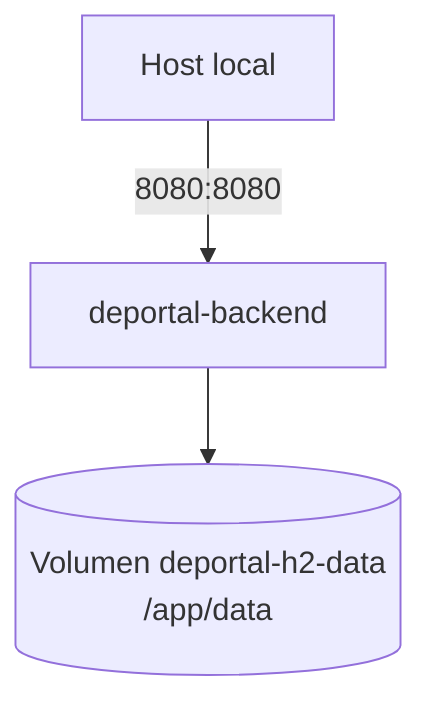
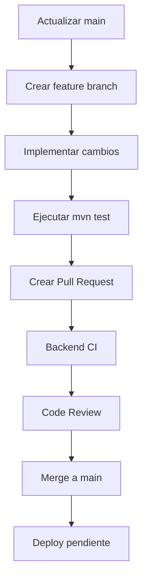

# Guia del Desarrollador - prueba_ceiba_springboot

## 1. Requisitos Previos

| Herramienta | Version minima | Proposito |
|---|---:|---|
| Java JDK | 21 | Compilar y ejecutar Spring Boot |
| Maven | 3.9.x | Build, dependencias y tests |
| Docker | `[Pendiente: version minima]` | Ejecutar contenedor local |
| Docker Compose | v2 | Levantar servicio backend |
| Git | 2.x | Control de versiones |
| curl | Cualquiera | Probar health check y endpoints |

Archivos/configuracion no versionada:

| Variable | Requerida | Valor local por defecto |
|---|---|---|
| `JWT_SECRET` | Recomendado | `deportal-local-development-secret-key-must-be-at-least-32-bytes` |
| `APP_CORS_ALLOWED_ORIGINS` | Opcional | `http://localhost:4200` |
| `SPRING_DATASOURCE_URL` | Opcional | `jdbc:h2:file:./data/deportal;MODE=PostgreSQL;...` |

> Nunca subir secretos reales al repositorio. El secreto incluido en `docker-compose.yml` es solo para desarrollo local.

## 2. Configuracion del Entorno Local

### 2.1 Clonar el repositorio

```bash
git clone <URL_DEL_REPOSITORIO>
cd prueba_ceiba_springboot
```

### 2.2 Configurar variables de entorno

Para ejecucion directa con Maven:

```bash
export JWT_SECRET="deportal-local-development-secret-key-must-be-at-least-32-bytes"
export APP_CORS_ALLOWED_ORIGINS="http://localhost:4200"
```

Para Docker Compose no es obligatorio exportarlas, porque `docker-compose.yml` ya define valores locales.

### 2.3 Instalar dependencias y ejecutar pruebas

```bash
mvn test
```

### 2.4 Iniciar servidor de desarrollo con Maven

```bash
mvn spring-boot:run
```

URLs utiles:

| Servicio | URL |
|---|---|
| API base | `http://localhost:8080` |
| Health check | `http://localhost:8080/api/health` |
| Swagger UI | `http://localhost:8080/swagger-ui.html` |
| OpenAPI JSON | `http://localhost:8080/v3/api-docs` |
| H2 console | `http://localhost:8080/h2-console` |

Datos H2 locales:

| Campo | Valor |
|---|---|
| JDBC URL Maven | `jdbc:h2:file:./data/deportal` |
| JDBC URL Docker | `jdbc:h2:file:/app/data/deportal` |
| Usuario | `sa` |
| Password | vacio |

### 2.5 Iniciar con Docker Compose

```bash
docker compose up --build
```

Detener servicios:

```bash
docker compose down
```

Eliminar volumen de base de datos local Docker:

```bash
docker compose down -v
```

### 2.6 Migraciones y seeds

No hay herramienta de migraciones versionada como Flyway o Liquibase. Hibernate actualiza el esquema con `spring.jpa.hibernate.ddl-auto=update`.

Los datos semilla se cargan automaticamente con `DataInitializer` al iniciar la aplicacion si las tablas estan vacias:

| Tipo | Datos |
|---|---|
| Canchas | Cancha Central, Norte, Sur, Multiusos Este |
| Usuarios | admin, Juan Perez, Maria Garcia, Carlos Lopez |
| Productos | Reserva de cancha, Alquiler de balon, Bebida hidratante |

Credenciales locales semilla:

```text
admin@deportal.local / Deportal123
juan.perez@deportal.local / Deportal123
maria.garcia@deportal.local / Deportal123
carlos.lopez@deportal.local / Deportal123
```

## 3. Contenedores / Servicios



| Servicio | Puerto | Descripcion |
|---|---:|---|
| `backend` | `8080` | API Spring Boot |
| `deportal-h2-data` | N/A | Volumen persistente H2 |

## 4. Comandos Utiles

| Descripcion | Comando |
|---|---|
| Ejecutar pruebas | `mvn test` |
| Levantar API con Maven | `mvn spring-boot:run` |
| Empaquetar JAR | `mvn clean package` |
| Levantar Docker | `docker compose up --build` |
| Ver logs Docker | `docker compose logs -f backend` |
| Detener Docker | `docker compose down` |
| Validar Compose | `docker compose config` |
| Health check | `curl -fsS http://localhost:8080/api/health` |
| Login local | `curl -s -X POST http://localhost:8080/api/auth/login -H 'Content-Type: application/json' -d '{"email":"admin@deportal.local","password":"Deportal123"}'` |

## 5. Flujo de Trabajo Git

Estrategia recomendada mientras no exista una politica formal:

| Rama | Uso |
|---|---|
| `main` | Codigo estable y desplegable |
| `feature/<descripcion>` | Desarrollo de nuevas funcionalidades |
| `fix/<descripcion>` | Correccion de defectos |
| `docs/<descripcion>` | Cambios de documentacion |



## 6. Despliegue / CI-CD

El repositorio incluye GitHub Actions en `.github/workflows/backend-ci.yml`.

Triggers:

| Evento | Accion |
|---|---|
| `push` | Ejecuta pipeline completo |
| `pull_request` | Ejecuta pipeline completo |

Pasos del pipeline:

1. Checkout del repositorio.
2. Setup de Java 21 Temurin con cache Maven.
3. `mvn test`.
4. `docker compose config`.
5. `docker compose build backend`.
6. `docker compose up -d backend`.
7. Health check contra `http://localhost:8080/api/health`.
8. `docker compose down`.

Despliegue a Dev/QA/Prod: `[Pendiente: definir]`.

## 7. Troubleshooting

| Problema | Causa probable | Solucion |
|---|---|---|
| Puerto `8080` ocupado | Otro proceso esta usando el puerto | Cambiar `server.port` o detener el proceso |
| Error con JWT secret | Secreto menor al requerido por HMAC | Usar un secreto de al menos 32 bytes |
| No puedo entrar a H2 console | JDBC URL incorrecta | Usar `jdbc:h2:file:./data/deportal` en Maven o `/app/data/deportal` en Docker |
| Login falla con usuarios semilla | Base previa con hashes antiguos o datos corruptos | Borrar `data/` local o volumen Docker y reiniciar |
| Tests fallan por contexto | Variables o puerto en conflicto | Ejecutar `mvn test` desde raiz con JDK 21 |
| CORS bloquea frontend | Origen no permitido | Configurar `APP_CORS_ALLOWED_ORIGINS` |
| Docker no arranca | Imagen desactualizada o volumen corrupto | Ejecutar `docker compose down -v` y luego `docker compose up --build` |
