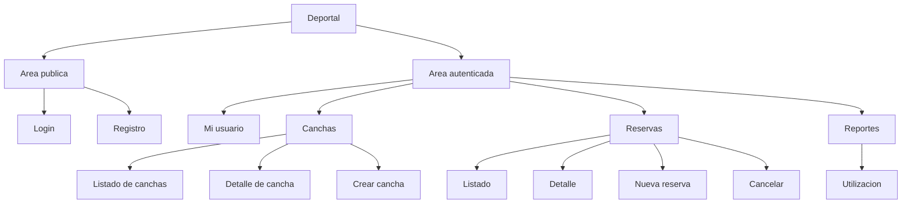
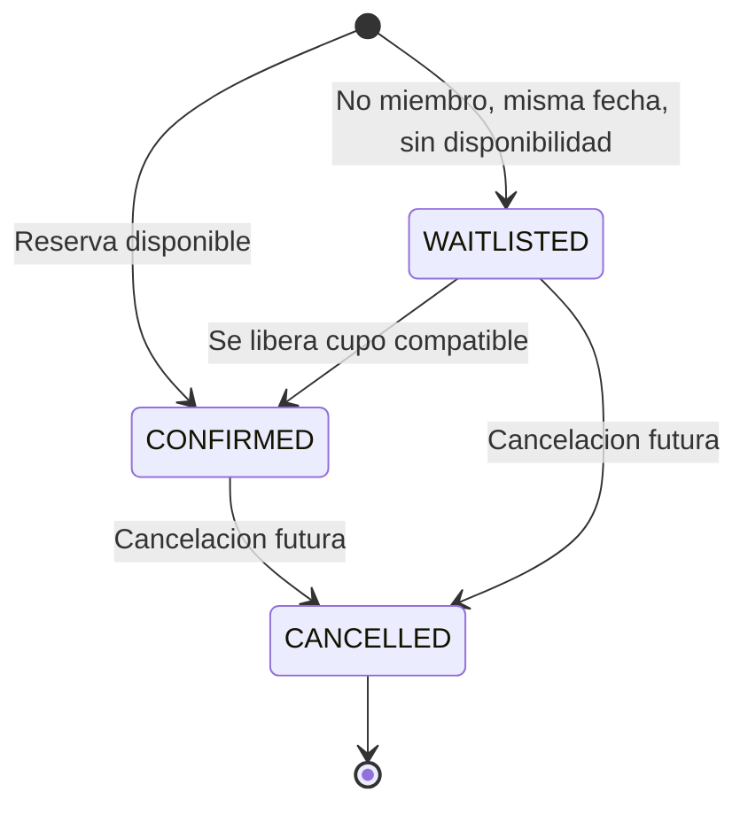
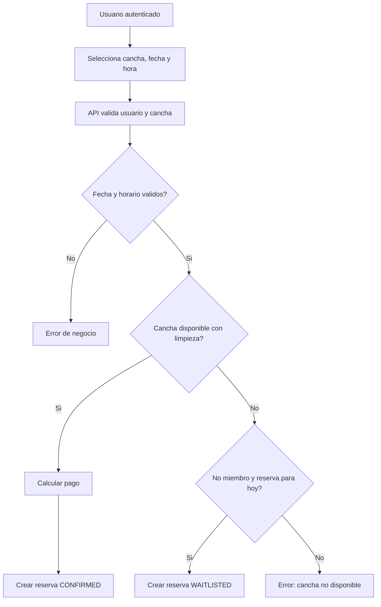
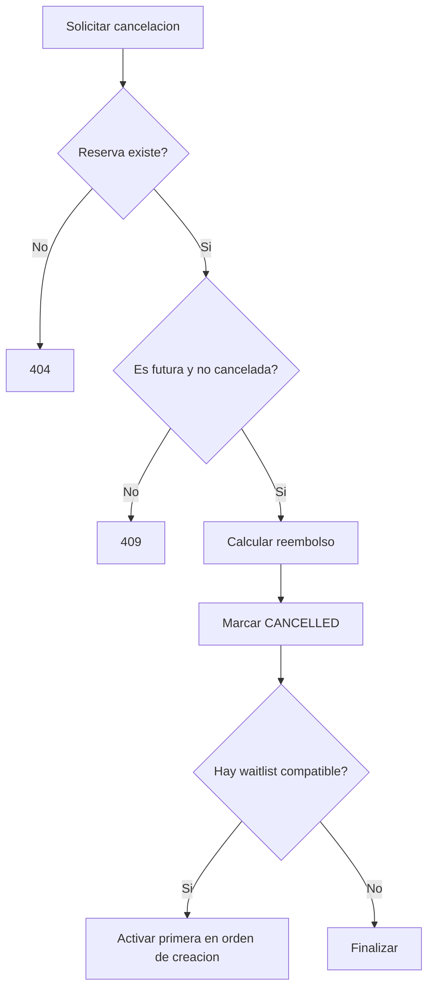

# Documentacion Funcional - prueba_ceiba_springboot

## 1. Descripcion General del Producto

Deportal es una API para administrar reservas de canchas deportivas. Permite registrar usuarios, autenticar sesiones mediante token, consultar y crear canchas, generar reservas con reglas de disponibilidad, gestionar cancelaciones con reembolsos, activar listas de espera y consultar reportes de utilizacion e ingresos.

Publico objetivo:

| Perfil | Necesidad |
|---|---|
| Administrador deportivo | Gestionar canchas, disponibilidad y reportes |
| Cliente miembro | Reservar canchas con beneficios de descuento |
| Cliente no miembro | Reservar canchas y usar lista de espera en condiciones especificas |
| Desarrollador frontend | Consumir endpoints REST para construir interfaz web o movil |

Caracteristicas principales:

| Caracteristica | Descripcion |
|---|---|
| Autenticacion | Registro, login y consulta de usuario autenticado |
| Canchas | Listado, consulta y creacion de canchas deportivas |
| Reservas | Creacion, consulta y cancelacion de reservas |
| Lista de espera | Reservas no miembro del dia pueden quedar en espera si no hay disponibilidad |
| Pagos | Calculo de tarifa base, descuento por miembro, descuento por horario valle y total |
| Reportes | Utilizacion por cancha, horas reservadas, ingresos y ocupacion |
| Health check | Validacion simple de disponibilidad de la API |

Metodos de acceso: API REST JSON. No hay interfaz web incluida en este repositorio.

---

## 2. Navegacion y Estructura de la Interfaz

No existe frontend versionado. La navegacion funcional sugerida para un cliente web seria:

---

## 3. Modulos Principales

### 3.1 Autenticacion y Usuarios

Proposito: permitir registro, login y recuperacion del perfil autenticado.

Endpoints:

| Metodo | Ruta | Descripcion | Auth |
|---|---|---|---|
| POST | `/api/auth/register` | Registra usuario y retorna JWT | No |
| POST | `/api/auth/login` | Autentica usuario y retorna JWT | No |
| GET | `/api/auth/me` | Retorna usuario autenticado | Si |

Campos importantes:

| Campo | Tipo | Validaciones |
|---|---|---|
| `name` | Texto | Obligatorio, maximo 120 caracteres |
| `email` | Email | Obligatorio, formato email, maximo 180, unico |
| `password` | Texto | Obligatorio, 8 a 80 caracteres |
| `customerType` | Enum | `MIEMBRO`, `NO_MIEMBRO` |
| `role` | Enum | `ADMIN`, `USER` |

Reglas de negocio:

| Regla | Resultado |
|---|---|
| Email duplicado | Error 409 |
| Usuario inactivo | No puede iniciar sesion |
| Password incorrecta | Error 409 con mensaje generico |
| Registro exitoso | Usuario queda con rol `USER` segun mapper actual |

### 3.2 Canchas

Proposito: mantener el catalogo operativo de canchas reservables.

Endpoints:

| Metodo | Ruta | Descripcion | Auth |
|---|---|---|---|
| GET | `/api/courts` | Lista canchas | Si |
| GET | `/api/courts/{courtId}` | Consulta cancha | Si |
| POST | `/api/courts` | Crea cancha | Si |

Campos importantes:

| Campo | Tipo | Validaciones |
|---|---|---|
| `name` | Texto | Obligatorio, maximo 120, unico sin distinguir mayusculas |
| `sportType` | Enum | `FUTBOL`, `BASQUET`, `TENIS`, `MULTIUSOS` |
| `capacity` | Numero | Minimo 1, maximo 50 |
| `openingTime` | Hora | Obligatoria, dentro de 06:00 a 22:00 |
| `closingTime` | Hora | Obligatoria, posterior a apertura, maximo 22:00 |
| `hourlyRate` | Decimal | Obligatorio, minimo 5.00 |

Reglas de negocio:

| Regla | Resultado |
|---|---|
| Apertura >= cierre | Error 409 |
| Horario fuera de 06:00-22:00 | Error 409 |
| Nombre repetido | Error 409 |

### 3.3 Reservas

Proposito: crear, consultar y cancelar reservas de canchas.

Endpoints:

| Metodo | Ruta | Descripcion | Auth |
|---|---|---|---|
| GET | `/api/reservations` | Lista reservas | Si |
| GET | `/api/reservations/{reservationId}` | Consulta reserva | Si |
| POST | `/api/reservations` | Crea reserva | Si |
| POST | `/api/reservations/{reservationId}/cancel` | Cancela reserva futura | Si |

Campos importantes:

| Campo | Tipo | Validaciones |
|---|---|---|
| `userId` | UUID texto | Obligatorio, debe existir |
| `courtId` | UUID texto | Obligatorio, debe existir |
| `date` | Fecha | Obligatoria, no puede estar en pasado |
| `startTime` | Hora | Obligatoria |
| `durationHours` | Numero | Minimo 1, maximo 8 |
| `customerType` | Enum | Obligatorio |

Reglas de negocio:

| Regla | Resultado |
|---|---|
| Reserva en pasado | Error 409 |
| Fuera de horario global 06:00-22:00 | Error 409 |
| Fuera del horario propio de la cancha | Error 409 |
| Conflicto con reserva confirmada considerando 1h de limpieza antes y despues | No disponible |
| Cancha no disponible y cliente `NO_MIEMBRO` para fecha actual | Reserva queda `WAITLISTED` |
| Cancha no disponible en otros casos | Error 409 |
| Cancelacion de reserva pasada o actual | Error 409 |
| Cancelacion de reserva ya cancelada | Error 409 |

Estados:

### 3.4 Pagos y Reembolsos

Proposito: calcular importes asociados a la reserva.

Reglas de descuentos:

| Concepto | Regla |
|---|---|
| Base | `hourlyRate * durationHours` |
| Miembro | 10% de descuento |
| Horario valle | 20% si inicia antes de 10:00 o despues de 19:00 |
| Tope descuento | Maximo 30% del valor base |
| Redondeo | 2 decimales, `HALF_UP` |

Reglas de reembolso por cancelacion:

| Tiempo antes de la reserva | Reembolso |
|---|---:|
| Mas de 24 horas | 100% |
| Entre 2 y 24 horas | 50% |
| Menos de 2 horas | 0% |

### 3.5 Reportes

Proposito: entregar indicadores de utilizacion por cancha.

Endpoint:

| Metodo | Ruta | Descripcion | Auth |
|---|---|---|---|
| GET | `/api/reports/utilization?from=YYYY-MM-DD&to=YYYY-MM-DD` | Reporte por rango | Si |

Metricas:

| Metrica | Calculo |
|---|---|
| `reservationCount` | Cantidad de reservas confirmadas |
| `reservedHours` | Suma de duracion de reservas confirmadas |
| `availableHours` | Horas operativas de cancha * dias del rango |
| `totalIncome` | Suma de `totalAmount` de reservas confirmadas |
| `occupancyRate` | `reservedHours / availableHours * 100` |

---

## 4. Configuracion y Administracion

No existe un panel administrativo en este repositorio. Las acciones administrativas disponibles son por API:

| Accion | Disponible |
|---|---|
| Crear canchas | Si, via `POST /api/courts` |
| Gestionar usuarios | Parcial, registro y consulta propia |
| Roles y permisos granulares | Parcial, roles existen pero endpoints no aplican restricciones por rol |
| Configuracion global | Via `application.yml` y variables de entorno |

---

## 5. Reportes y Dashboards

Reporte disponible: utilizacion por cancha.

Filtros:

| Filtro | Tipo | Obligatorio |
|---|---|---|
| `from` | Fecha ISO | Si |
| `to` | Fecha ISO | Si |

Dashboard sugerido para frontend:

| KPI | Fuente |
|---|---|
| Ingresos totales | Suma de `totalIncome` |
| Ocupacion promedio | Promedio de `occupancyRate` |
| Cancha mas reservada | Mayor `reservationCount` |
| Horas reservadas | Suma de `reservedHours` |

---

## 6. Integraciones

No se identifican integraciones funcionales con CRM, ERP, pasarelas de pago, correo o notificaciones. El calculo de pago es interno y no procesa cobros reales.

---

## 7. Flujos de Trabajo

### Reserva de cancha

### Cancelacion y lista de espera

---

## 8. Roles y Permisos

Roles existentes en dominio:

| Rol | Descripcion |
|---|---|
| `ADMIN` | Administrador semilla del sistema |
| `USER` | Usuario regular registrado |

Matriz funcional actual:

| Accion | Publico | USER | ADMIN |
|---|---:|---:|---:|
| Health check | Si | Si | Si |
| Registro | Si | Si | Si |
| Login | Si | Si | Si |
| Consultar perfil | No | Si | Si |
| Listar/consultar canchas | No | Si | Si |
| Crear canchas | No | Si | Si |
| Crear/listar/cancelar reservas | No | Si | Si |
| Consultar reportes | No | Si | Si |

> Nota: aunque existen roles, el codigo actual solo valida autenticacion para endpoints protegidos. No hay restricciones `ADMIN` por metodo.
