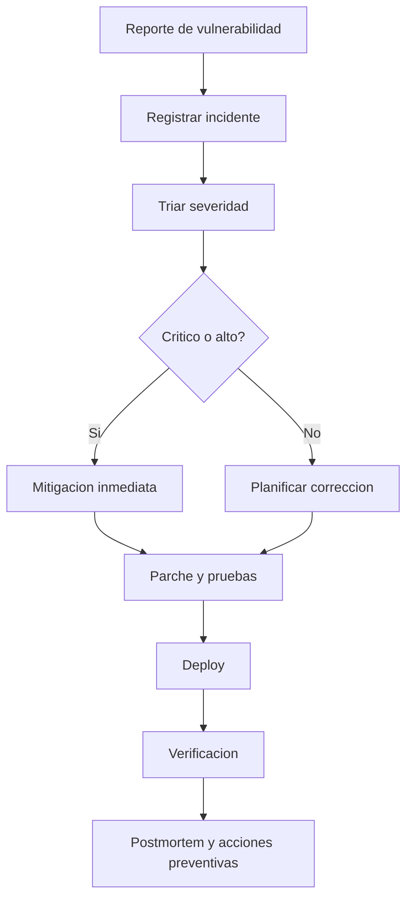
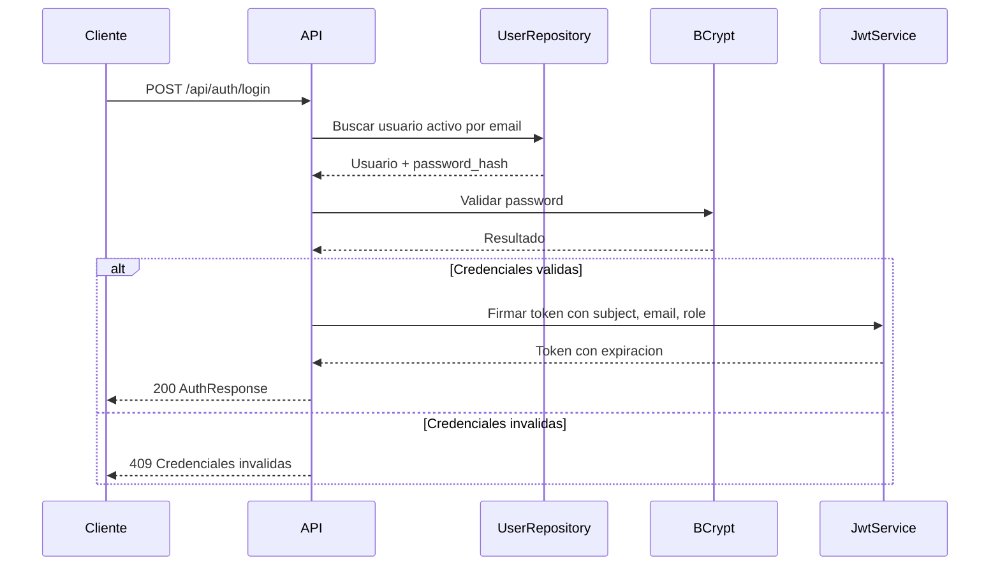

# Documentacion de Seguridad - prueba_ceiba_springboot

## 1. Postura de Seguridad General

La postura recomendada para Deportal es Security by Design con controles simples, auditables y adecuados para una API REST. El estado actual cubre autenticacion JWT, contrasenas con BCrypt, validacion de entradas, CORS configurable, manejo centralizado de errores y persistencia mediante JPA.

Cumplimiento normativo:

| Marco | Estado |
|---|---|
| GDPR / Habeas Data | `[Pendiente: evaluar segun pais y datos personales tratados]` |
| PCI-DSS | No aplica actualmente; no hay procesamiento real de pagos |
| SOC2 | `[Pendiente: definir si aplica]` |
| HIPAA | No aplica segun dominio actual |

Datos personales identificados: nombre, email, tipo de cliente, historial de reservas.

## 2. Autenticacion y Control de Acceso IAM

Mecanismos implementados:

| Control | Estado |
|---|---|
| Registro con email/password | Implementado |
| Login con email/password | Implementado |
| JWT Bearer | Implementado |
| Password hashing | BCrypt |
| Roles | `ADMIN`, `USER` en dominio y JWT |
| MFA | No implementado |
| OAuth2/SAML | No implementado |
| Bloqueo por fuerza bruta | No implementado |
| Refresh tokens | No implementado |

Gestion de sesiones:

| Aspecto | Valor |
|---|---|
| Modelo | Stateless |
| Transporte | Header `Authorization: Bearer <token>` |
| Expiracion | 8 horas (`28800000 ms`) |
| Revocacion | No implementada |
| Rotacion | No implementada |

Matriz de acceso actual:

| Recurso | Publico | Autenticado |
|---|---:|---:|
| `/api/auth/register` | Si | Si |
| `/api/auth/login` | Si | Si |
| `/api/auth/me` | No | Si |
| `/api/health` | Si | Si |
| `/swagger-ui.html`, `/swagger-ui/**`, `/v3/api-docs/**` | Si | Si |
| `/h2-console/**` | Si en configuracion actual | Si |
| `/api/courts/**` | No | Si |
| `/api/reservations/**` | No | Si |
| `/api/reports/**` | No | Si |

> Control critico: restringir Swagger y H2 console fuera de desarrollo.

## 3. Proteccion de Datos

### En transito

La aplicacion local corre por HTTP en `8080`. En produccion debe publicarse exclusivamente detras de TLS 1.2 o 1.3.

| Control | Estado |
|---|---|
| TLS local | No |
| TLS produccion | `[Pendiente: configurar en proxy/ingress]` |
| HSTS | No configurado en la app |
| Cookies seguras | No aplica; usa Bearer token |

### En reposo

| Dato | Proteccion actual | Recomendacion |
|---|---|---|
| Passwords | BCrypt | Mantener costo adecuado y nunca loggear hashes |
| JWT secret | Variable/config local | Usar secret manager en ambientes reales |
| Base H2 | Archivo sin cifrado explicito | Usar DB productiva con cifrado en reposo |
| PII | Persistida en tablas | Definir retencion y minimizacion |

### Backups

No hay politica de backups versionada.

| Aspecto | Estado recomendado |
|---|---|
| Frecuencia | `[Pendiente: definir RPO/RTO]` |
| Inmutabilidad | `[Pendiente: definir]` |
| Restauracion | Probar periodicamente |

## 4. Seguridad en la Aplicacion AppSec

Validacion de entradas:

| Area | Control |
|---|---|
| DTOs | Jakarta Validation (`@NotBlank`, `@Email`, `@Size`, `@Min`, `@Max`, `@DecimalMin`) |
| JSON desconocido | `fail-on-unknown-properties: true` |
| Email | Normalizacion a trim/lowercase en autenticacion |
| Sanitizacion texto | `StringSanitizer` elimina `<` y `>` y normaliza espacios, aunque no se observa uso generalizado |

OWASP Top 10:

| Riesgo | Estado |
|---|---|
| Broken Access Control | Parcial: autenticacion global, sin autorizacion por rol en metodos |
| Cryptographic Failures | Passwords con BCrypt; DB local sin cifrado explicito |
| Injection | Mitigado por JPA/repositories y validacion |
| Insecure Design | Reglas de negocio centralizadas en servicios |
| Security Misconfiguration | H2 console y Swagger publicos son aceptables solo localmente |
| Vulnerable Components | CI no ejecuta SCA actualmente |
| Auth Failures | JWT y BCrypt implementados; falta rate limiting/bloqueo |
| Integrity Failures | Docker build en CI; no hay firma de artefactos |
| Logging/Monitoring Failures | No hay auditoria de seguridad versionada |
| SSRF | No hay llamadas salientes identificadas |

Cabeceras de seguridad:

| Header | Estado |
|---|---|
| `X-Frame-Options` | `sameOrigin` para permitir H2 console local |
| CSP | No configurado |
| HSTS | No configurado |
| CORS | Configurable por `app.cors.allowed-origins` |

Manejo de errores:

| Error | Respuesta |
|---|---|
| Validacion | 400 con mapa de campos |
| Negocio | 409 |
| No encontrado | 404 |
| Inesperado | 500 con mensaje generico `Unexpected server error` |

## 5. Infraestructura y Red

Estado actual:

| Componente | Estado |
|---|---|
| Docker | Imagen multi-stage, JRE final Temurin 21 |
| Contenedor | Expone 8080 |
| Base de datos | H2 en volumen Docker/local |
| WAF/DDoS | `[Pendiente: definir en infraestructura]` |
| Segmentacion red | `[Pendiente: definir]` |
| Hardening contenedor | Parcial; no se define usuario no root en Dockerfile |

Recomendaciones para produccion:

| Prioridad | Recomendacion |
|---|---|
| Alta | Deshabilitar H2 console |
| Alta | Usar base de datos administrada/productiva |
| Alta | Ejecutar contenedor con usuario no root |
| Alta | Publicar detras de TLS |
| Media | Agregar rate limiting en auth |
| Media | Restringir Swagger por perfil o autenticacion |

## 6. Gestion de Secretos

Politica: no subir secretos reales al codigo.

Secretos/configuraciones sensibles:

| Secreto | Uso | Estado actual |
|---|---|---|
| `JWT_SECRET` | Firma JWT | Valor local por defecto en config/compose |
| `SPRING_DATASOURCE_PASSWORD` | Password DB | Vacio para H2 local |

Herramientas recomendadas por entorno:

| Entorno | Herramienta |
|---|---|
| Local | Variables de entorno o `.env` no versionado |
| GitHub Actions | GitHub Secrets |
| Cloud | Secret Manager/KMS/Vault segun proveedor |

Rotacion: `[Pendiente: definir frecuencia y procedimiento]`.

## 7. SDLC Seguro

Pipeline actual:

| Control | Estado |
|---|---|
| Tests unitarios | `mvn test` en CI |
| Docker smoke test | `docker compose up` + `/api/health` |
| SAST | No configurado |
| DAST | No configurado |
| SCA/dependency scanning | No configurado explicitamente |
| Revision de codigo | `[Pendiente: politica de PR]` |

Recomendaciones:

| Control | Herramienta sugerida |
|---|---|
| SCA | Dependabot, OWASP Dependency-Check o Snyk |
| SAST | CodeQL para Java |
| Secret scanning | GitHub Secret Scanning / gitleaks |
| DAST | OWASP ZAP contra ambiente temporal |

## 8. Respuesta a Incidentes

Canal de reporte: `[Pendiente: definir security contact/email]`.

Proceso recomendado:

SLA recomendado:

| Severidad | Ejemplo | Tiempo objetivo |
|---|---|---|
| Critica | Bypass auth, fuga masiva de datos | 24 horas |
| Alta | Escalada de privilegios, secreto expuesto | 72 horas |
| Media | Validacion incompleta explotable | 7 dias |
| Baja | Hardening o informacion menor | 30 dias |

## Flujo de Login Seguro

