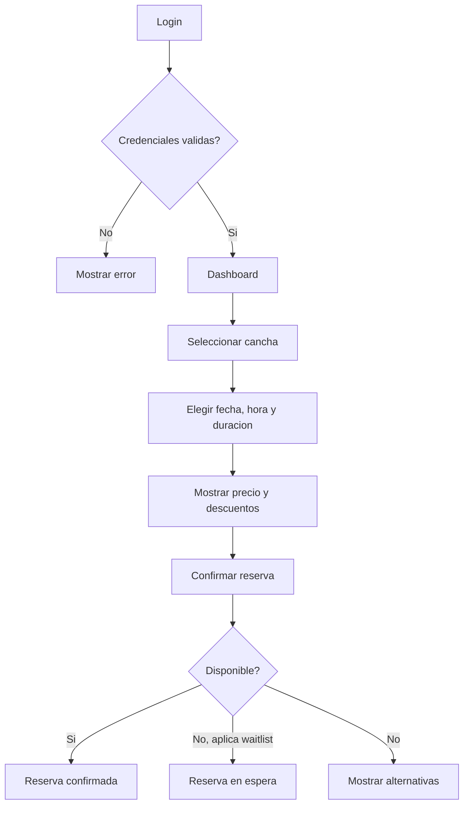
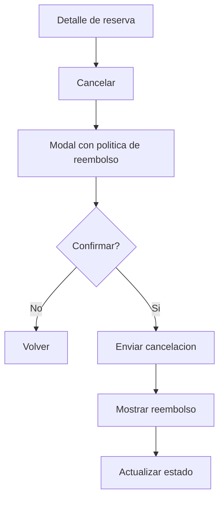

# Guia UX/UI - prueba_ceiba_springboot

## 1. Principios de Diseno

Aunque este repositorio solo contiene backend, esta guia define una referencia visual para un frontend Deportal que consuma la API.

Filosofia visual: interfaz deportiva, clara y operacional. Debe transmitir disponibilidad, velocidad de reserva y confianza en pagos/reembolsos sin sobrecargar al usuario.

Principios de experiencia:

| Principio | Aplicacion |
|---|---|
| Eficiencia ante todo | Reservar una cancha debe requerir pocos pasos |
| Claridad sobre densidad | Horarios, precios y estados deben ser evidentes |
| Feedback inmediato | Mostrar disponibilidad, descuentos y errores en contexto |
| Confianza transaccional | Confirmaciones, cancelaciones y reembolsos deben ser explicitos |
| Accesibilidad | Objetivo WCAG 2.1 AA |

## 2. Sistema de Diseno

### 2.1 Color

Paleta recomendada:

| Token | HEX | RGB | HSL | Uso |
|---|---|---|---|---|
| Primary 600 | `#166534` | `22,101,52` | `142 64% 24%` | Acciones principales, confirmacion deportiva |
| Primary 500 | `#22C55E` | `34,197,94` | `142 71% 45%` | Estados disponibles |
| Secondary 600 | `#0369A1` | `3,105,161` | `201 96% 32%` | Navegacion y enlaces |
| Surface | `#F8FAFC` | `248,250,252` | `210 40% 98%` | Fondo claro |
| Text | `#0F172A` | `15,23,42` | `222 47% 11%` | Texto principal |
| Muted | `#64748B` | `100,116,139` | `215 16% 47%` | Texto secundario |
| Error | `#DC2626` | `220,38,38` | `0 72% 51%` | Errores y cancelaciones |
| Success | `#16A34A` | `22,163,74` | `142 76% 36%` | Reserva confirmada |
| Warning | `#D97706` | `217,119,6` | `33 95% 44%` | Lista de espera |
| Info | `#2563EB` | `37,99,235` | `221 83% 53%` | Mensajes informativos |

Variables CSS:

```css
:root {
  --color-primary-600: #166534;
  --color-primary-500: #22c55e;
  --color-secondary-600: #0369a1;
  --color-surface: #f8fafc;
  --color-card: #ffffff;
  --color-text: #0f172a;
  --color-muted: #64748b;
  --color-error: #dc2626;
  --color-success: #16a34a;
  --color-warning: #d97706;
  --color-info: #2563eb;
}

[data-theme="dark"] {
  --color-surface: #020617;
  --color-card: #0f172a;
  --color-text: #e5e7eb;
  --color-muted: #94a3b8;
}
```

Modo claro: usar fondos amplios `Surface` con cards blancas. Modo oscuro: reservar colores saturados para estados y mantener buen contraste.

### 2.2 Tipografia

Familias recomendadas:

| Uso | Fuente |
|---|---|
| Headings | Inter, system-ui, sans-serif |
| Body | Inter, system-ui, sans-serif |
| Code/IDs | JetBrains Mono, monospace |

Escala:

| Estilo | Tamano | Line-height | Peso |
|---|---:|---:|---:|
| H1 | 32px | 40px | 700 |
| H2 | 24px | 32px | 700 |
| H3 | 20px | 28px | 600 |
| Body | 16px | 24px | 400 |
| Small | 14px | 20px | 400 |
| Caption | 12px | 16px | 500 |

### 2.3 Iconografia

Set recomendado: SVG inline o libreria Lucide/Material Icons.

| Tamano | Uso |
|---|---|
| 16px | Labels, badges, inputs |
| 20px | Botones y navegacion |
| 24px | Encabezados de cards |
| 32px | Empty states |

Reglas: no usar iconos sin etiqueta accesible cuando representen acciones criticas; acompanar cancelacion y reembolso con texto.

### 2.4 Espaciado y Layout

Escala basada en 4px:

| Token | Valor |
|---|---:|
| `space-1` | 4px |
| `space-2` | 8px |
| `space-3` | 12px |
| `space-4` | 16px |
| `space-6` | 24px |
| `space-8` | 32px |
| `space-12` | 48px |

Breakpoints:

| Nombre | Ancho |
|---|---:|
| Mobile | `0-639px` |
| Tablet | `640-1023px` |
| Desktop | `1024px+` |
| Wide | `1280px+` |

Layout recomendado: sidebar en desktop, bottom navigation o drawer en mobile. Grilla de canchas con cards responsivas.

## 3. Componentes UI Core

### Botones

| Variante | Uso | Default | Hover | Disabled | Focus |
|---|---|---|---|---|---|
| Primary | Confirmar reserva | Fondo primary | Mas oscuro | Opacidad 50% | Ring 2px primary |
| Secondary | Acciones neutrales | Borde secondary | Fondo suave | Opacidad 50% | Ring secondary |
| Ghost | Navegacion secundaria | Transparente | Fondo gris | Opacidad 50% | Ring visible |
| Danger | Cancelar reserva | Fondo error | Mas oscuro | Opacidad 50% | Ring error |

### Inputs

| Tipo | Reglas |
|---|---|
| Text/Email | Label visible, helper text opcional, error debajo |
| Password | Toggle de visibilidad, nunca mostrar por defecto |
| Select | Mostrar enums traducidos: Miembro, No miembro, Futbol, Tenis |
| Date/Time | Validar rango y horario antes de enviar |
| Checkbox/Radio | Area clicable minima 44px |
| Toggle | Solo para estados binarios no destructivos |

### Cards y Contenedores

Cards de cancha deben mostrar nombre, deporte, capacidad, horario, tarifa y estado. Usar badges para `Disponible`, `No disponible`, `En espera`.

### Modales y Drawers

Usar modal para confirmaciones destructivas como cancelar reserva. En mobile, preferir bottom sheet/drawer para filtros de busqueda.

### Alertas y Toasts

| Tipo | Uso |
|---|---|
| Success | Reserva creada, cancelacion exitosa |
| Warning | Reserva en lista de espera, reembolso parcial |
| Error | Validaciones o reglas de negocio fallidas |
| Info | Horarios, politicas de limpieza, descuentos |

### Tablas y Listas

Tablas para reportes en desktop. En mobile, transformar filas en cards apiladas con campos clave: cancha, reservas, horas, ingresos, ocupacion.

## 4. Patrones de Interaccion

Navegacion:

| Patron | Uso |
|---|---|
| Sidebar | Desktop autenticado |
| Breadcrumb | Detalle de cancha/reserva |
| Paginacion | `[Pendiente: backend no pagina actualmente]` |
| Tabs | Separar reservas confirmadas, canceladas y espera |

Feedback:

| Estado | Patron |
|---|---|
| Carga inicial | Skeleton cards |
| Accion corta | Spinner inline en boton |
| Reporte | Barra indeterminada superior |
| Empty state | Ilustracion simple + CTA |

Errores:

| Caso | Mensaje recomendado |
|---|---|
| Cancha no disponible | `Ese horario ya no esta disponible. Prueba otro bloque.` |
| Reserva fuera de horario | `La cancha opera entre {apertura} y {cierre}.` |
| Login fallido | `Email o contrasena incorrectos.` |
| Token expirado | `Tu sesion expiro. Inicia sesion nuevamente.` |

Micro-interacciones: transiciones de 150-200ms para hover/focus, animacion discreta al confirmar reserva y resaltado temporal de descuentos aplicados.

## 5. Flujos de Usuario

### Login y reserva



### Cancelacion



## 6. Contenido y Tono

Voz: clara, confiable y activa. El producto debe sentirse como un asistente operativo, no como un sistema burocratico.

Reglas de UX writing:

| Elemento | Guia |
|---|---|
| Botones | Verbos concretos: `Reservar`, `Cancelar reserva`, `Ver reporte` |
| Errores | Explicar causa y siguiente paso |
| Confirmaciones | Incluir estado, cancha, fecha, hora y total |
| Reembolsos | Mostrar monto y regla aplicada |
| Estados | Usar lenguaje del usuario: `Confirmada`, `En espera`, `Cancelada` |

Ejemplos:

| Contexto | Texto recomendado |
|---|---|
| Reserva confirmada | `Reserva confirmada para Cancha Central el 2026-06-30 a las 10:00.` |
| Lista de espera | `No hay disponibilidad ahora. Te agregamos a la lista de espera para este horario.` |
| Reembolso total | `Cancelacion exitosa. Recibiras el reembolso completo.` |
| Error de validacion | `Revisa la duracion. Debe estar entre 1 y 8 horas.` |
